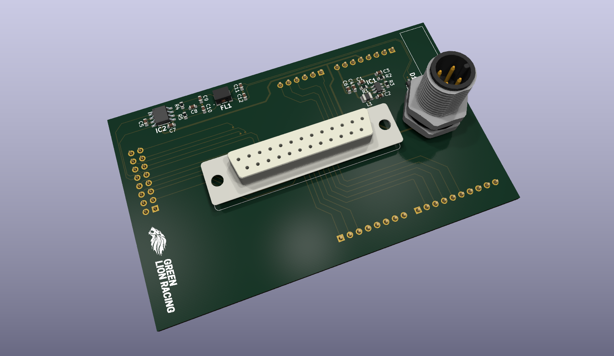
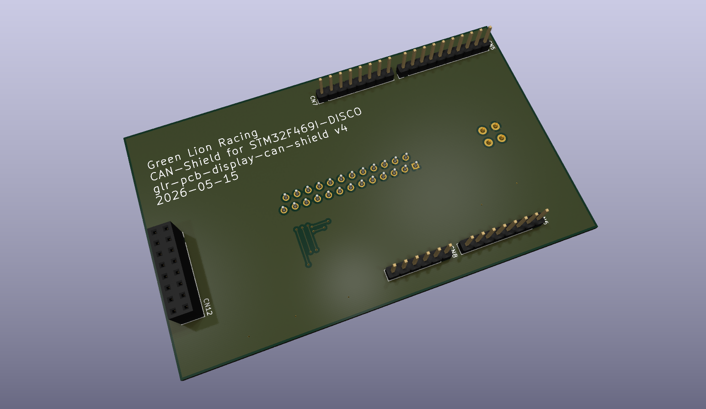

# CAN-Shield for STM32F469I-DISCO

STM32F469I-DISCO board compatible CAN shield.

  
  

## Overview

Provides 8V for the discovery board, from 24V car voltage.

Acts as can transciever for the discovery board.

Accessible screw terminals for buttons signals to the discovery board.

Can be directly slotted on to the board.

## Used parts

| Article                          | Description                 | Link                                                                                                          | Quantity |
| -------------------------------- | --------------------------- | ------------------------------------------------------------------------------------------------------------- | -------- |
| STMircoelectronics L9615D013TR   | 12V can transiever          | https://www.mouser.de/ProductDetail/STMicroelectronics/L9615D013TR?qs=RNlBCa%2FBPH2bRRygw50SdQ%3D%3D          | 1        |
| STMicroelectronics LF80CDT-TR    | voltage regulator 12V -> 8V | https://www.mouser.de/ProductDetail/STMicroelectronics/LF80CDT-TR?qs=jjdktuRV%2FggWfgmU%252Bn%252BoRA%3D%3D   | 1        |
| STMicroelectronics ESDCAN01-2BLY | dual-line TVS diode         | https://www.mouser.de/ProductDetail/STMicroelectronics/ESDCAN01-2BLY?qs=Ok1pvOkw6%2FpNzC2RQnWwPA%3D%3D        | 1        |
| Samsung CL10B104KB8NNNC          | capacitor 100nF             | https://www.mouser.de/ProductDetail/Samsung-Electro-Mechanics/CL10B104KB8NNNC?qs=349EhDEZ59rvGc2rLwVOdA%3D%3D | 2        |
| Vishay CRCW060368R1FKEA          | resistor 68ohm              | https://www.mouser.de/ProductDetail/Vishay-Dale/CRCW060368R1FKEA?qs=6z8JnUK2jyMngsBXu5il1A%3D%3D              | 1        |
| WECO 950-FB-04                   | 4-pin screw terminal        | https://www.buerklin.com/de/p/weco/leiterplattenklemmen/20877004/08H410/                                      | 1        |
| WECO 950-FB-08                   | 8-pin screw terminal        | https://www.buerklin.com/de/p/weco/leiterplattenklemmen/20877008/08H420/                                      | 1        |
| Generic header                   | 8-pin header 2.54mm         |                                                                                                               | 1        |
| Generic header                   | 6-pin header 2.54mm         |                                                                                                               | 1        |
| Generic socket                   | 2x8-pin socket 2.54mm       |                                                                                                               | 1        |

## Used pins and their connector

| Element | Chip Pin | Connector Pin |
| ------- | -------- | ------------- |
| 5V      | -        | CN6 Pin 5     |
| GND     | -        | CN6 Pin 6,7   |
| 8V IN   | -        | CN6 Pin 8     |

### Button 1-6

| Element  | Chip Pin | Connector Pin |
| -------- | -------- | ------------- |
| Button 1 | PB1      | CN8 Pin 1     |
| Button 2 | PC4      | CN8 Pin 4     |
| Button 3 | PC5      | CN8 Pin 5     |
| Button 4 | PA4      | CN8 Pin 6     |
| Button 5 | PD3      | CN5 Pin 6     |
| Button 6 | PB14     | CN5 Pin 5     |

### Incremental Rotary Encoder 1-2

| Element                   | Chip Pin | Connector Pin |
| ------------------------- | -------- | ------------- |
| Incremental Encoder 1 CLK | PB15     | CN5 Pin 4     |
| Incremental Encoder 1 DT  | PH6      | CN5 Pin 3     |
| Incremental Encoder 1 SW  | PA7      | CN5 Pin 2     |
| Incremental Encoder 2 CLK | PG13     | CN7 Pin 3     |
| Incremental Encoder 2 DT  | PG14     | CN7 Pin 2     |
| Incremental Encoder 2 SW  | PG9      | CN7 Pin 1     |

### Absolute Rotary Encoder 1-3

| Element               | Chip Pin | Connector Pin |
| --------------------- | -------- | ------------- |
| Absolute Encoder 1 P1 | PA8      | CN12 Pin 3    |
| Absolute Encoder 1 P2 | PB4      | CN12 Pin 5    |
| Absolute Encoder 1 P3 | PC6      | CN12 Pin 6    |
| Absolute Encoder 2 P1 | PA8      | CN12 Pin 7    |
| Absolute Encoder 2 P2 | PA5      | CN12 Pin 8    |
| Absolute Encoder 2 P3 | PC7      | CN12 Pin 11   |
| Absolute Encoder 3 P1 | PA15     | CN12 Pin 12   |
| Absolute Encoder 3 P2 | PB12     | CN12 Pin 13   |
| Absolute Encoder 3 P3 | PC13     | CN12 Pin 14   |
| Absolute Encoder 3 P4 | PC1      | CN12 Pin 15   |
